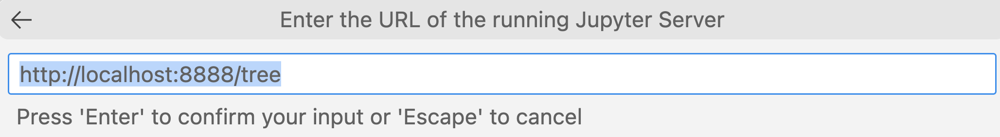

# Jupyter

This page describes the basic setup of a locally-running Jupyter Notebook Server.

---

## Docs

- https://pypi.org/project/notebook/
- https://jupyter-notebook.readthedocs.io/en/stable/
- https://jupyter-notebook.readthedocs.io/en/stable/configuring/config_overview.html
- [jupyter notebook --help-all](docs/jupyter-help-all.txt)

### Visual Studio Code (VSC) Docs

- https://code.visualstudio.com/docs/datascience/jupyter-notebooks
- https://code.visualstudio.com/docs/editor/workspace-trust

### Semantic Kernel

- https://learn.microsoft.com/en-us/semantic-kernel/agents/plugins/using-the-kernelfunction-decorator?tabs=Csharp

- https://learn.microsoft.com/en-us/semantic-kernel/agents/plugins/out-of-the-box-plugins?tabs=Csharp


### OpenAI

- **openai** python library
  - https://pypi.org/project/openai/
  - https://github.com/openai/openai-python

---

## Configuration

To create a **jupyter_server_config.py** file in the **~/.jupyter** directory,
with all the defaults commented out, use the following command:

```
$ jupyter server --generate-config
Writing default config to: /Users/cjoakim/.jupyter/jupyter_server_config.py
```

- [Generated jupyter_server_config.py](docs/jupyter_server_config.py)

### Config via CLI args

```
jupyter notebook --NotebookApp.port=8000
```

CTRL-C for immediate shutdown:

```
# c.JupyterApp.answer_yes = False
c.JupyterApp.answer_yes = True
```

Disable auth token:

```
# c.ServerApp.token = '<DEPRECATED>'
c.ServerApp.token = ''
```

---

## Run the Jupyter Notebook Server locally

### Create Python Virtual Environment

With your necessary libraries specified in the **requirements.in** file.

On Windows 11:

```
.\venv.ps1
```

On macOS and Linux:

```
./venv.sh
```

### Start the Jupyter Notebook Server

On Windows 11:

```
.\jupyter_start.ps1
```

On macOS and Linux:

```
./jupyter_start.sh
```

---

## Editing and Executing *.ipynb Notebooks

### Web Browser 

Visit http://localhost:8888/tree

### Visual Studio Code (VSC) 

See the above documentation links.

#### Open a *.ipynb in VSC

See **nb1.ipynb** in this repo as an example.

Click the **Select Kernel** button at top-right of the IDE,
and enter the URL of the locally running Jupyter Notebook Server.

<p align="center">
  
</p>

See https://code.visualstudio.com/docs/datascience/jupyter-notebooks

---

## Azure OpenAI Jupyter Notebooks

See - [Azure OpenAI Jupyter Notebooks](docs/jupyter-azure-openai.md)
